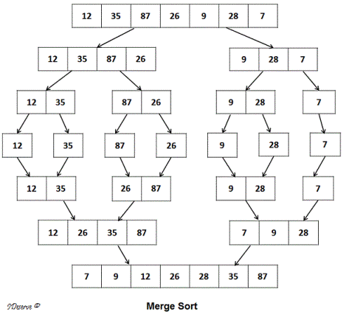

# 5. MergeSort (재귀함수)

> 합병 정렬 또는 병합 정렬(merge sort)은 O(n log n) 비교 기반 정렬 알고리즘이다. 일반적인 방법으로 구현했을 때 이 정렬은 안정 정렬에 속하며, 분할 정복 알고리즘의 하나이다. 존 폰 노이만이 1945년에 개발했다.   
> 최악 시간복잡도	O(n log n)  
> 최선 시간복잡도	O(n log n)  
> 평균 시간복잡도	일반적으로, O(n log n)  
> 공간복잡도	О(n)  

* 분할 : 해결하고자 하는 문제를 작은 크기의 동일한 문제들로 분할
* 정복 : 각각의 작은 문제를 순환적으로 해결
* 합병 : 작은 문제의 해를 합하여 원래 문제에 대한 해를 구함

* 단점 : 데이터와 동일한 배열크기의 값을 생성 해야함.....

