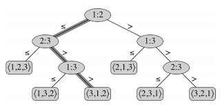

# 8. 정렬 알고리즘. 

> O(n log n) 보다 시간복잡도가 더 낮아질순 없을까??       
* 하한(Lower bound)
  1) 입력된 데이터를 한번씩 다 보기 위해서 최서 O(n)의 시간 복잡도가 필요  
  2) 합병정렬과 힙정렬 알고리즘들의 시간복잡도는 O(n log n)
  3) 어떤 comparison sort 도 이보다 나아질순 없다.
  4) Decision Tree  
     (1) 최악의 경우 시간 복잡도는 트리의 높이  
     (2) 트리의 높이는 height >= log n! = n log n  
       
  
  
   

* Comparison sort  
  1) 데이터들간의 상대적 크기관계만을 이용해서 정렬하는 알고리즘  
  2) 따라서 데이터들간의 크기 관계가 저으이되어 있으면 어떤 데이터에든 적용가능 (문자열, 알파벳, 사용자 정의 객체 등)
  3) bubble, insert, merge , quick, heap 정렬 등.
    
    
    
==============================================================
      
* Non-comparison sort
  1) 정렬에 데이터에 대한 사전지식을 이용 
  2) Bucket sort
  3) Radix sort