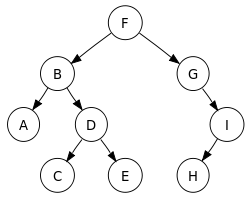

# 12. Binary Tree

> 트리 구조(tree 構造, 문화어: 나무구조)란 그래프의 일종으로, 여러 노드가 한 노드를 가리킬 수 없는 구조이다. 간단하게는 회로가 없고, 서로 다른 두 노드를 잇는 길이 하나뿐인 그래프를 트리라고 부른다.  
> 트리에서 최상위 노드를 루트 노드(root node 뿌리 노드[*])라고 한다.   
> 또한 노드 A가 노드 B를 가리킬 때 A를 B의 부모 노드(parent node), B를 A의 자식 노드(child node)라고 한다.   
> 자식 노드가 없는 노드를 잎 노드(leaf node 리프 노드[*])라고 한다.  
>  잎 노드가 아닌 노드를 내부 노드(internal node)라고 한다.  
  

## 트리 순회

> 전산학에서 트리 순회(Tree traversal)는 트리 구조에서 각각의 노드를 정확히 한 번만, 체계적인 방법으로 방문하는 과정을 말한다.  
> 이는 노드를 방문하는 순서에 따라 분류된다. 여기서 설명하는 알고리즘은 이진 트리에 대해서 작성되었지만, 다른 모든 트리에서도 일반화될 수 있다.  

## 전위 순회
* 전위 순회(preorder)는 다음과 같은 방법으로 진행한다. 

1. 노드를 방문한다.  
2. 왼쪽 서브 트리를 전위 순회한다.  
3. 오른쪽 서브 트리를 전위 순회한다.  
4. 전위 순회는 깊이 우선 순회(depth-first traversal)라고도 한다.  

## 중위 순회
* 중위 순회(Inorder)은 다음의 순서로 진행된다.  

1. 왼쪽 서브 트리를 중위 순회한다.  
2. 노드를 방문한다.  
3. 오른쪽 서브 트리를 중위 순회한다.  
4. 중위 순회는 대칭 순회(symmetric)라고도 한다.  

## 후위 순회
* 후위 순회(postorder)는 다음과 같은 방법으로 진행한다.

1. 왼쪽 서브 트리를 후위 순회한다.
2. 오른쪽 서브 트리를 후위 순회한다.
3. 노드를 방문한다.  

## 레벨 순서 순회
* 레벨 순서 순회(level-order)는 모든 노드를 낮은 레벨부터 차례대로 순회한다. 레벨 순서 순회는 너비 우선 순회(breadth-first traversal)라고도 한다.  

  

* 전위 순회: F, B, A, D, C, E, G, I, H (root, left, right)
* 중위 순회: A, B, C, D, E, F, G, H, I (left, root, right)
* 후위 순회: A, C, E, D, B, H, I, G, F (left, right, root)
* 레벨 순서 순회: F, B, G, A, D, I, C, E, H