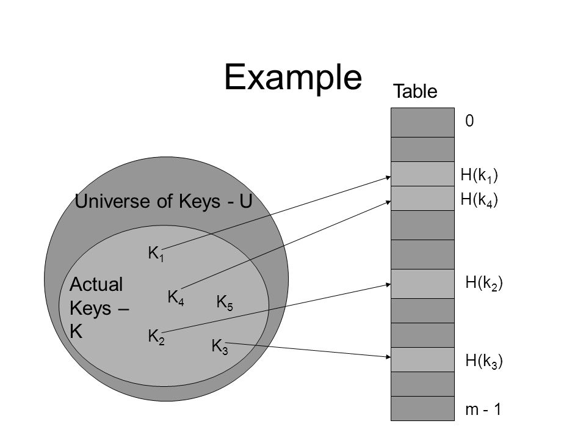

# 15. Hashing

## Hash Table  
> 해시 테이블(hash table), 해시 맵(hash map), 해시 표는 컴퓨팅에서 키를 값에 매핑할 수 있는 구조인, 연관 배열 추가에 사용되는 자료 구조이다.   
> 해시 테이블은 해시 함수를 사용하여 색인(index)을 버킷(bucket)이나 슬롯(slot)의 배열로 계산한다.  

### 해시함수 
> 해시 함수(hash function)는 임의의 길이의 데이터를 고정된 길이의 데이터로 매핑하는 함수이다. 해시 함수에 의해 얻어지는 값은 해시 값, 해시 코드, 해시 체크섬 또는 간단하게 해시라고 한다.  
> 해시 함수의 질은 입력 영역에서의 해시 충돌 확률로 결정되는데, 해시 충돌의 확률이 높을수록 서로 다른 데이터를 구별하기 어려워지고 검색하는 비용이 증가하게 된다.  

### ex)
1. 모든 키들을 자연수라고 가정 
2. ASCII 코드 : C=67, L=76 , R=82 , S=83
3. 문자열 CLRS 는 67 * 128^3 + 76 * 128^2 + 82 * 128 + 83 = 141,764,947
4. 해쉬함수의 간단한 예
   1) H(k) = k % m , 즉 key를 하나의 자연수로 해석한 후 테이블의 크기 m으로 나눈 나머지
   2) 항상 0 ~ m-1 사이의 정수가 됨

    
   

### Problem    
1. 두 개 이상의 키가 동일한 위치로 해슁 되는 경우    
2. 즉 서로 다른 두 키 k1 ,k2 에 대해서 h(k1) = h(k2)인 상황    
3. 일반적으로 |U| > m 이므로 항상 발생가능 ( 즉 단사함수가 아님 )    
4. 만약 |k| > m 라면 당연히 발생, k는 실제로 저장된 키들의 집합    
5. 충돌이 발생할 경우 대처 방법이 필요    
6. 대표적인 두가지 충돌 해결방법 : chaining 과 open addressing    

### Solution    

* chaining   
> 동일한 장소로 해슁돈 모든 키들을 하나의 연결리스트로 저장    

1. 키의 삽입    
- 키 k를 리스트의 맨앞에 삽입 : 시간복잡도 O(1)  
- 중복된 키가 들어올 수 있고 중복 저장이 허용되지 않는다면 삽입시 리스트를 검색해야 함. 따라서 시간복잡도는 리스트의 길이에 비례  

2. 키의 검색  
- 리스트 에서 순차검색  
- 시간복잡도는 키가 저장된 리스트의 길이에 비례  

3. 키의 삭제   
- 리스트로 부터 키를 검색 후 삭제  
- 일단 키를 검색해서 찾은 후에는 O(1)시간에 삭제 가능  

> 최악의 경우 모든 키가 하나의 슬롯으로 해슁되는 경우  
> 길이가 n인 하나의 연결 리스트가 만들어짐  
> 따라서 최악의 경우 탐색 시간은 O(n) + 해쉬함수 계산시간  
> 평균시간복잡도는 키들이 여러 슬롯에 얼마나 잘 분배되느냐에 의해서 결정  

