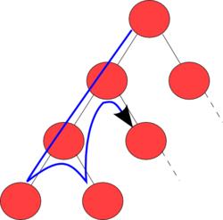

# 16-2. DFS 

> 깊이 우선 탐색(depth-first search: DFS)은 맹목적 탐색방법의 하나로 탐색트리의 최근에 첨가된 노드를 선택하고,  
> 이 노드에 적용 가능한 동작자 중 하나를 적용하여 트리에 다음 수준(level)의 한 개의 자식노드를 첨가하며, 첨가된 자식 노드가 목표노드일 때까지 앞의 자식 노드의 첨가 과정을 반복해 가는 방식이다.  

* 깊이 우선 탐색은 재귀함수를 통해 가장 깊숙히 들어가고 없으면 나오는 형태.

    