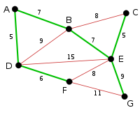

# 17. Minimum Spanning Tree

## Problem    
* 최소의 비용으로 모든 도시들이 서로 연결되게 한다.  

## 특징   
1. 무방향 가중치 그래프  
2. 각 선에 대해서 가중치  
3. 모든 에지들에 의해 그래프의 모든 정점들이 서로 연결된다.  
4. 가중치의 합이 최소가 된다.  
5. 싸이클이 없는 연결된 무방향 그래프 트리.  

### generic-MST algorithm  
> http://www.personal.kent.edu/~rmuhamma/Algorithms/MyAlgorithms/GraphAlgor/genericMST.htm  

1. 처음에는  A = 공집합  
2. 집합 A에 대해서 안전한 에지를 하나 찾은 후 이것을 A에 더한다.  
  1) 그래프의 정점들을 두개의 집합 s와 v-s로 분할한 것을 컷 (s,v-s)라고 부른다.  
  2) 에지에 대해서 에지의 정점이 S 와  V-S 연결하는 에지라면 ( cross ) 한다고 한다.  
  3) 2번 사항에 cross 하지 않으면 ( respect ) 라고 한다.   
  4) cross 하는 에지들 중 가장 가중치가 작은 에지를 A에 대해 가장 안전하다.  
3. 에지의 개수가 n-1개가 될때까지 2번을 반복.  

### Kruskal algorithm  

1. 에지들을 가중치의 오름차순으로 정렬한다.  
2. 에지들을 그 순서대로 하나씩 선택해 간다. 단, 이미 선택된 에지드롸 사이클을 형성되면 성택하지 않는다.  
3. n-1개의 에지가 선택되면 종료한다.  

### Prim algorithm

1. 임의의 노드를 출발 노드로 선택  
2. 출발노드를 포함하는 트리를 점점 키워감.  
3. 매 단계에서 이미 트리에 포함된 노드와 포함되지 않은 노드를 연결하는 에지들 중 가장 가중치가 작은 에지를 선택  

