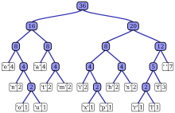

# 19-1. Huffman coding with RLE

> 파일을 구성하는 각각의 run 들을 하나의 super-symbol로 본다.     
> 이 super-symbol들에 대해서 Huffman coding 을 적용한다.  
> 그후 super-symbol 의 등장 횟수를 구한다.  
> symbol, run length, frequency 로 구성된다.   

1. Huffman 알고리즘은 트리들의 집합을 유지한다.  
2. 매 단계 에서 가장 빈도수가 작은 두 트리를 찾아서 두 트리를 하나로 합친다.  
* 이런 연산에 가장 적합한 자료구조는 최소힙(우선순위큐) 이다.  
* 가장 high-level의 노드만 symbol,run length , frequency 만 가지고 부모노드는 빈도수만을 가지는 트리 완성.  

