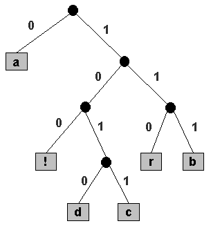

# 19. Compress

## 압축기법
1. 고정길이
- 고정된 길이로 인코딩 - 디코딩
2. 가변길이
- 가변된 길이로 인코딩 -디코딩
- 문제점: 가변길이이기 때문에 규칙이 없을시 인코딩 - 디코딩간 다른 내용이 될 수 있다.
* 해결 
1) prefix code 
- a 가 0 라면 어떤 값도 0으로 시작할수 없다.  
- prefix 를 사용하면 모호함을 제거 할 수 있다.

## 허프만 코딩
> 허프만 부호화는 문자들의 빈도로부터 접두 부호(어떤 한 문자에 대한 부호가 다른 부호들의 접두어가 되지 않는 부호)를 만들어 내는 알고리즘으로,  
> 적게 나오는 문자일수록 더 긴 부호를 쓰고 많이 나올수록 더 짧은 부호를 쓴다.   
> 허프만 부호화는 주어진 빈도에 대해서 항상 최적의 접두 부호를 만들어 내며,   
> 이 과정은 빈도가 정렬되어 있을 경우 O(n)만에 가능하다.   
> 각 문자들의 빈도가 2의 거듭제곱 꼴이거나 모두 같을 경우 이 접두 부호는 간단한 이진 블록 부호와 동일하다.  

1. 초기화 : 모든 기호를 출현 빈도수에 따라 나열한다.  
2. 단 한 가지 기호가 남을 때까지 아래 단계를 반복한다.  
  1. 목록으로부터 가장 빈도가 낮은 것을 2개 고른다.  
  2. 그 다음 허프만이 두가지 기호를 부모 노드를 가지는 부트리를 구성하고 자식노드를 생성한다. 부모 노드 단 기호들의 빈도수를 더하여 주 노드에 할당하고 목록의 순서에 맞도록 목록에 삽입한다.  
  3. 목록에서 부모노드에 포함된 기호를 제거한다.  
  
## Run-length 인코딩
> 런은 동이한 문자가 하나 혹은 그이상 연속해서 나오는 것을 의미한다.  
> 예를 들어 s="aaabba"는 다음과 같은 3개의 런으로 구성된다 "aaa","bb","a"  
> 인코딩시 3a2b1a  
> Run-length encoding 은 길이가 긴 run 들이 많은 경우에 효과적이다.  
 