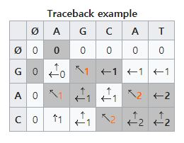

# 20. Dynamic Programming  

## 동적 계획법
> subproblem 들을 풀어서 원래 문제를 푸는 방식. 그런 의미에서 분할 정복법과 공통성이 있음    
> 분할 정복법에서는 분할된 문제들이 서로 disjoint 하지만 동적 계획법에서는 그렇지 않음.    
> 즉, 서로 overlapping 하는 subproblem 들을 해결 함으로써 원래 문제를 해결.  
> 어떤 문제의 최적해가 그것의 subproblem 들의 최적해로부터 효율적으로 구해질 수 있을 때 그 문제는  optimal substructure 를 가진다 고 한다.  
> A problem is said to have optimal substrructure if an optimal solution can be constructed efficiently from optimal solutions of its subproblems.    

* 분할정복법, 탐욕적기법, 동적계획법은 모두 문제가 가진 이런 특성을 이용한다.
  
  
  
## Memoization Vs Dynamic Programming
> 순환식의 계산하는 기법
> 둘다 동적 계획법의 일종
> Memoization 은 top-down 방식 이며, 실제로 필요한 subproblem만을 푼다.
> 동적계획법은 bottom-up 방식 이며, recursion에 수반되는 오버헤드가 없다. 
 
## 피보나치 수열   
* 재귀 함수 문제점: 똑같은 값의 함수를 재실행 함. 많은 계산이 중복됨.  
* 해결  
1. 중간 계산 결과를 캐싱함으로써 중복 계산을 피함. (Memoizaion)  

```java
int fib(int n){
	if( n==1 || n==2 )
		return 1;
	else if( f[n] > -1 )
		return f[n];
	else {
		f[n] = fib(n-2)+ fib(n-1);
		return f[n];
	}
}
```
2. bottom-up 방식
```java 
int fib(int n){

	f[1]=f[2]=1;
	for(int i=3;i<=n;i++)
		f[i]=f[i-1]+[i-2];
	return f[n];	
}
```

## 이항계수
> nCr=(nr)=n!r!(n−r)!


```java
int binomial(int n, int k)
{
	for( int i = 0; i<=n ; i++){
		for(int j=0;j<=k && j<=i;j++){
			if( k==0 || n==k )
				binom[i][j] = 1;
			else
				binom[i][j] = binom[i-1][j-1] + binom[i-1][j];
		}
	}
	return binom[n][k];
} 
```

## Key Observation
> 정수들이 저장된 n x n 행렬의 좌상단에서 우하단까지 이동한다. 단 오른쪽 이나 아래쪽 방향으로만 이동한다.  
> 방문한 칸에 있는 정수들의 합이 최소화 되도록 하라.  

* L[i,j].sum = (1,1)에서  (i,j) 까지 이르는 최소값.  
* m[i,j].value = (i,j) 에 값.
1. if i=1 && j=1 , m[i,j].value  
2. if j=1 , L[i-1,j].sum + m[i,j].value  
3. if i=1 , L[i,j-1].sum + m[i.j].value  
4. if otherwise , min( L[i-1,j].sum , L[i,j-1].sum) + m[i,j].value    

## Longest Common Subsequence
> bcdb 는 abcbdab 의 subsequence 이다.  <a+'bc'+b+'d'+a+'b'>  
> bca는 문자열 abcbdab 와 bdcaba 의 common subsequence 이다.  
> Longest common subsequence (LCS)
* common subsequence 중 가장긴것
 
  

## Matrix Chain Multiplication  
> 행렬 A는 10X100, B는 100X5, C는 5X50
> 세 행렬의 곱 ABC는 두가지 방법으로 계산가능 (결합법칙이 성립)
> 행렬의 곱 A(m x n) X B(n x r) = C (m x r)
> 1.(AB)C : 7,500번의 곱셈이 필요 (10X100X5 + 10X5X50)
> 2.A(BC) : 75,000번의 곱셈이 필요 ( 10 X 100 X 50 +( 100 X 5 X 50 ))
> 즉 곱하는 순서에 따라서 연산량이 다름.


